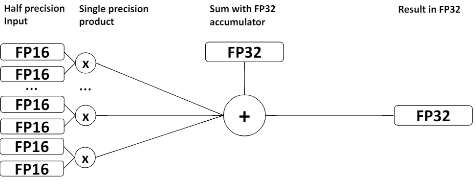
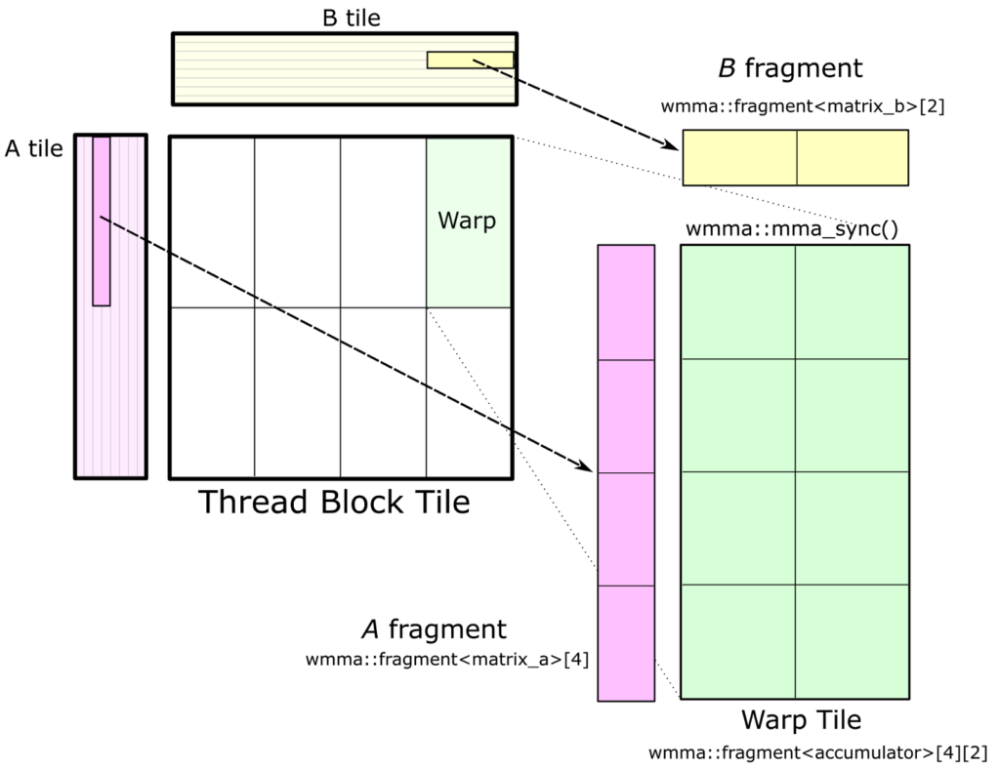
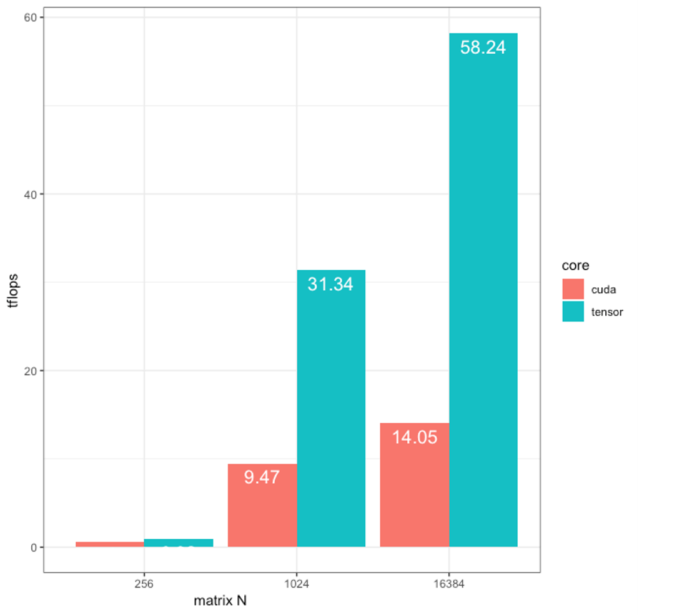

Tensor Core 기반의 행렬곱 가속화 및 딥러닝 적용 방식 분석
==============================================
팀명: Tencore 팀원: 이호중,한승탁,김용호,조준형
--------------------------------------

## 목 차
1. 과 제 목 적
2. 텐 서 코 어
3. 실      험
4. 기 대 효 과

***
## 1.과 제 목 적
최근 CCTV 시장에서 지능형 또는 인지형 CCTV에 대한 수요가 증가하고 있습니다. 우리 회사는 지리정보 시스템 및 관제전문 회사로 지능형 CCTV 개발에 
많은 관심을 가지고 있고 개발에 임하고 있습니다.이번 캡스톤 과제에서 학생들이 지능형 시스템에 활용되는 딥러닝 적용시 GPU 구조의 핵심 기술인
Tensor Core를 이용한 가속화 부분에 대해서 연구하여 기업이 이를 활용할 수 있도록 한다.

***
## 2.텐 서 코 어

### 2-1. Tensor Core 소개
32비트의 부동소수점 연산을 수행하는 Cuda Core와 달리 Tensor Core는 16비트의 부동소수점으로 연산 한 뒤 
32비트의 부동소수점으로 축적합니다. 16비트 연산은 32비트 연산과 비교하여 절반의 메모리 대역폭(Memory Bandwidth)과 
메모리 사용량(Memory Footprint)를 요구합니다. 따라서 Tensor Core는 더 빠른 연산을 수행할 수 있습니다.

### 2-2. wmma 이용 Tensor Core프로그래밍
GPU에서 행렬의 연산은 글로벌 메모리, 공유메모리, 레지스터 단위로 나누어 실행되며
Fragment는 core에서 수행되는 단위이며 WMMA는 텐서코어에서 Fragment단위로 실행할 수 있도록 제공하고 합니다. 
다음은 WMMA 이용하여 A_matrix * B_matrix + C_matrix 를 계산하는 예입니다. 처음에 Fragment를 다음과 같이 선언해야 합니다. 
wmma::fragment<wmma::matrix_a, M, N, K, half, wmma::col_major> a_frag;
wmma::fragment<wmma::matrix_b, M, N, K, half, wmma::col_major> b_frag;
wmma::fragment<wmma::accumulator, M, N, K, float> acc_frag;

앞에서부터 matrix_a옵션은 수식에서 A_matrix을 나타내며 B_matrix은 matrix_b로 설정합니다. 
결과가 축적되는 C_matrix는 accumulator로 설정하여야 합니다. 
M,N과 K는 a_matrix가 M X N행렬이며 B_matrix가 N x K 행렬임을 선언해줍니다. 
이때 M,N,K는 16의 배수이어야 합니다. half는 자료형을 설정하는 옵션이며 16비트 부동소수점 자료형을 뜻하고
float는 32비트 부동소수점을 뜻합니다. 따라서 Tensor Core 연산에 사용되는 자료형은 half로 결과가 누적되는 accumulator에 float설정합니다. 
wmma::load_matrix_sync(a_frag, A_matrix, M);
wmma::load_matrix_sync(b_frag, B_matrix, K);
위와 같은 명령어를 통하여 앞서 선언된 a_frag에 A_matirx의 값을 넣어줍니다. 마지막 옵션은 행과 열의 크기입니다. 
wmma::mma_sync(acc_frag, a_frag, b_frag, acc_frag);.
wmma::store_matrix_sync(C_matrix, acc_frag, M, wmma::mem_col_major);
위와 같은 명령어를 통하여 명령어를 통하여 행렬 연산이 수행되며 C_matrix에 값이 저장됩니다.

### 2-3. cublas 이용 Tensor Core프로그래밍
 cubals는 cublas_v2.h을 이용합니다. cublasSetMathMode를 CUBLAS_TENSOR_OP_MATH로 설정하면 
 Tensor Core 라이브러리를 사용할 수 있습니다. 반대로 CUBLAS_DEFAULT_MATH로 설정시에는 라이브러리를 사용할 수 없습니다. 
 연산은 cubalsGemmEx함수를 이용합니다. 이 함수는 연산되는 행렬 각각의 자료형을 선택할 수 있습니다. 
 이 함수에서 옵션을 CUBLAS_GEMM_DFALT_TENSOR_OP으로 설정할 시 Tensor Core로 동작합니다. 
 반대로 CUBLAS_GEMM_DFALT로 설정하면 Cuad Core로 동작합니다.
 
예
cublasGemmEx(cublasHandle, CUBLAS_OP_N, CUBLAS_OP_N,  MATRIX_M, MATRIX_N, MATRIX_K,
                &alpha,a_fp16, CUDA_R_16F, MATRIX_M,
                b_fp16, CUDA_R_16F, MATRIX_K,
                &beta, 
                c_cublas, CUDA_R_32F, MATRIX_M,
                CUDA_R_32F, **CUBLAS_GEMM_DFALT_TENSOR_OP**)
                
***
 ## 3.실 험 
curand 함수를 통하여 임의의 값을 가지는 행렬을 생성하고 Tensor Core 와 Cuda Core를 이용하여 연산속도와 결과 값을 비교하였습니다. 
실험을 위하여 GPU는 NVIDIA GeForce RTX 2080 Ti(2080ti)이며 CUDA 10.0 toolkit에 있는 cublas라이브러리를 사용하였습니다. 
2080ti는 544개의 Tensor Core와 4352개의 Cuda Core를 가지고 있어 두 코어의 성능을 비교할 수 있었습니다. 
cublas 라이브러리는 코어 별 최적화된 행렬연산함수를 제공하기 때문에 코어 별 성능 비교에 사용했습니다.
3_1. flops 비교

<행렬 크기 별 계산한 Tera flops(계산된 행 x 열 x 2 /milliseconds/1e9)>

3_2. 결과 값 비교 
행렬의 크기 별로 Tflops(계산된 행 x 열 x 2 /milliseconds/10^9)를 측정한 결과 모든 행렬에서 Tensor Core의 연산속도가 더 빨랐으며 행렬의
크기가 증가할수록 차이가 더 많이 발생했습니다. 연산 결과는 각각 16비트와 32비트 부동소수점으로 표현된 행렬을 코어별로 비교하였습니다. 
그 결과 32비트 행렬의 값은 평균 0.002364546 표준편차 0.001353507의 오차가 발생하였습니다. 하지만 16비트로 표현된 행렬의 연산결과의 오차는 없었습니다.

3_3. 실험 결과
32비트 부동소수점연산에서 Tensor core 와 CUDA core에서 연산 결과는 조금씩 오차가 발생합니다. 
하지만 16비트 부동소수점연산에서는 결과 값이 같았습니다. flops로 측정한 연산 속도는 실험한 모든 행렬의 크기에서 Tensor Core에 
속도가 더 빨랐으며 행렬의 크기가 커질수록 차이가 더 발생했습니다.

***
 ## 4.기 대 효 과 
  딥러닝은 많은 행렬 곱연산을 처리해야 하므로 시간이 오래 걸린다는 것이 단점입니다. 그런데딥러닝 연산에서 사용되는 수는 16비트로 표현이 가능합니다.
때문에 16비트 연산으로 행렬곱연산을 가속화 시킬 수 있는 Tensor Core를 딥러닝에 이용한다면 딥러닝 학습 시간을 줄여 더 나은 신경망 개발에 도움이 될 것입니다.
